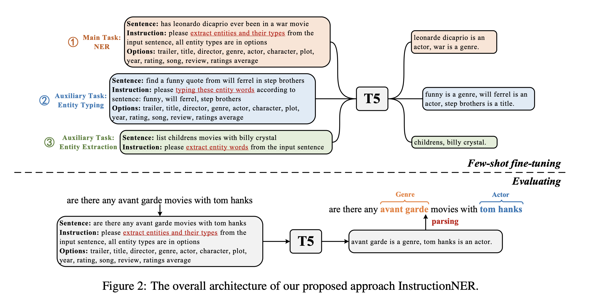

# InstructionNER: A Multi-Task Instruction-Based Generative Framework for Few-shot NER

[](https://github.com/ovbystrova/InstructionNER/actions/workflows/tests.yml)
[](https://codecov.io/gh/ovbystrova/InstructionNER)
[](https://github.com/ovbystrova/InstructionNER#requirements)
[](https://github.com/ovbystrova/InstructionNER/blob/main/LICENSE)

Unofficial implementation of [InstructionNER](https://arxiv.org/pdf/2203.03903v1.pdf).



## Requirements
Python >=3.8

## Installation
```shell
pip install -r requirements/requirements.in # for training purposes
pip install -r requirements/requirements_test.in # for tests
pip install -r requirements/requirements_dev.in # for inference only
```

## Data Preparation
In order to make a unified training interface, 
you can convert your raw input data (supported dataset formats: **conll**, **spacy**, **mit**)
with the following script:
```
python prepare_data.py \
--path_to_file 'data/conll2003/train.txt' \
--dataset_type 'conll2003' \
--output_folder 'data/conll2003' \
```

This script converts every dataset to a list of sentences.
Every sentence is like this:
```
{
    "context": "SOCCER - JAPAN GET LUCKY WIN , CHINA IN SURPRISE DEFEAT .",
    "entity_values": {
            "LOC": [
                "JAPAN"
            ],
            "PER": [
                "CHINA"
            ]
        },
    "entity_spans": [
            {
                "start": 9,
                "end": 14,
                "label": "LOC"
            },
            {
                "start": 31,
                "end": 36,
                "label": "PER"
            }
        ]
}
```

## Training
Script for training T5 model:
```
python train.py \
--path_to_instructions 'instructions.json' \
--path_to_options 'options.json' \
--log_dir 'runs/test_run' \
--eval_every_n_batches 200 \
--pred_every_n_batches 200 \
--path_to_model_config 'config.yaml' \
--path_to_model_save 'runs/model/' \
```

Arguments:
- **--path_to_instructions** - file with instruction prompts
- **--path_to_options** - file with mapping dataset to its entities
- **--log_dir** - where to log tensorboard
- **--eval_every_n_batches** - do evaluation every n batches
- **--pred_every_n_batches** - write n sample prediction every n batches
- **--path_to_model_config** - path to all necessary information for model
- **--path_to_model_save** - where to save model

## Evaluation
Script for evaluation of the trained model:
```
python evaluate.py \
--model_path_or_name 'olgaduchovny/t5-base-qa-ner-conll' \
--path_to_model_config 'config.yaml' \
--path_to_instructions 'instructions.json' \
--path_to_options 'options.json' \
```

Arguments:
- **--model_path_or_name** - path to trained model or HF model name
- **--path_to_model_config** - path to all necessary information for model
- **--path_to_instructions** - file with instruction prompts
- **--path_to_options** - file with mapping dataset to its entities

## Evaluation Results


Dataset | Precision | Recall | F1-Score (weighted)
--- | --- | --- | --- | 
CONLL-2003 | 0.862 | 0.843 | 0.852 
MIT MOVIE | 0.792 | 0.845 | 0.809 | 
MIT REST | 0.766 | 0.771 | 0.768 | 

## Prediction Sample
```
Sentence: The protest , which attracted several thousand supporters , coincided with the 18th anniversary of Spain 's constitution .
Instruction: please extract entities and their types from the input sentence, all entity types are in options
Options: ORG, PER, LOC

Prediction (raw text): Spain is a LOC.
```
## Inference 

### Models
[t5-base-ner-conll](https://huggingface.co/olgaduchovny/t5-base-ner-conll)

[t5-base-ner-mit-restaurant](https://huggingface.co/olgaduchovny/t5-base-ner-mit-restaurant)

[t5-base-ner-mit-movie](https://huggingface.co/olgaduchovny/t5-base-ner-mit-movie)

### Code
```python
from instruction_ner.model import Model

model = Model(
    model_path_or_name="olgaduchovny/t5-base-ner-conll",
    tokenizer_path_or_name="olgaduchovny/t5-base-ner-conll"
)

options = ["LOC", "PER", "ORG", "MISC"]

instruction = "please extract entities and their types from the input sentence, " \
              "all entity types are in options"

text = "My name is Olga. I am 24 years old. I live in Moscow and work at Sber AI Center as a Senior NLP Data Scientist." \
        "This is my reporitory to test generative NER problem with T5 model."

generation_kwargs = {
    "num_beams": 2,
    "max_length": 128
}

pred_text, pred_spans = model.predict(
    text=text,
    generation_kwargs=generation_kwargs,
    instruction=instruction,
    options=options
)

>>> ('Olga is a PER, Moscow is a LOC, Sber AI Center is an ORG, NLP is a MISC.',
 [(11, 15, 'PER'), (46, 52, 'LOC'), (65, 79, 'ORG'), (92, 95, 'MISC')])
```


# Citation
```bibtex
@article{wang2022instructionner,
  title={Instructionner: A multi-task instruction-based generative framework for few-shot ner},
  author={Wang, Liwen and Li, Rumei and Yan, Yang and Yan, Yuanmeng and Wang, Sirui and Wu, Wei and Xu, Weiran},
  journal={arXiv preprint arXiv:2203.03903},
  year={2022}
}
```
